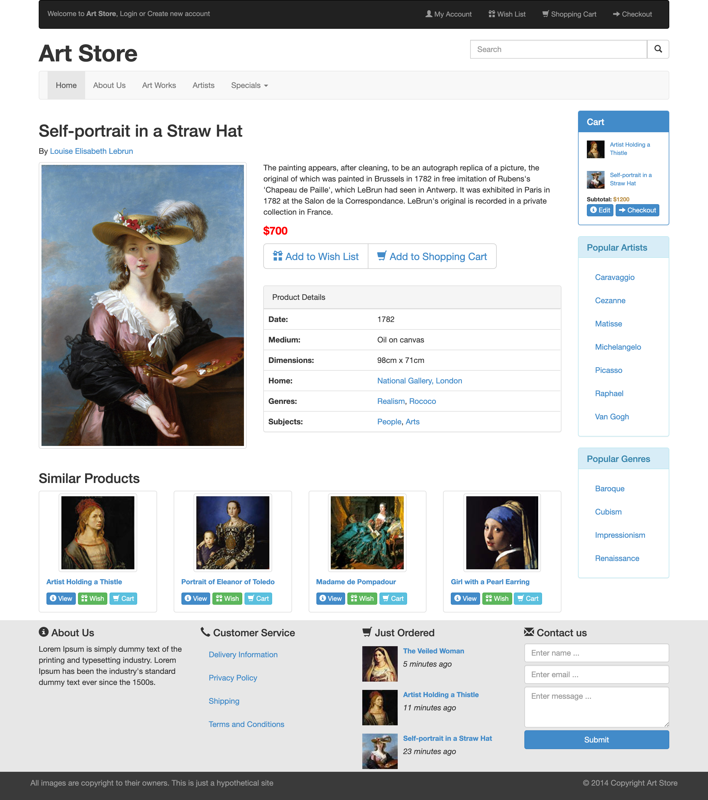

LAB 4作业要求
==========
本 LAB 只提供初始代码与完成效果图，需要通过修改初始代码使得最终网页展示效果与我们提供的效果图基本一致。

-------------------

## 作业提交 HOW TO SUBMIT
### 作业提交网址 ADDRESS
//github.com/(Your ID)/SOFT130002_lab

e.g. //github.com/veronicadavichi/SOFT130002_lab

即上传到你 lab4 的仓库中

-------------------

### 文件结构 FILE STRUCTURE
`root` 即直接打开仓库所见的层，或写作 `/lab4`。

```
/lab4
	/lab4.html
	/lab4.css
	/images
	/bootstrap-3.0.0
	/lab4 作业要求.md
	/sample.png
```

`lab4.html` 是<u>**唯一**</u>需要修改的页面，主要是<u>**使用Bootstrap的css样式**</u>。

本Lab使用的是**Bootstrap 3**，请到Bootstrap官网上查看使用说明。

-------------------

## 作业效果图

如下：



# DDL
截止时间为**2019年4月11日23:59:59**，也就是下周周四。
我们这周会出一个新的PDF，提供一个比较合理的作业提交方式。
