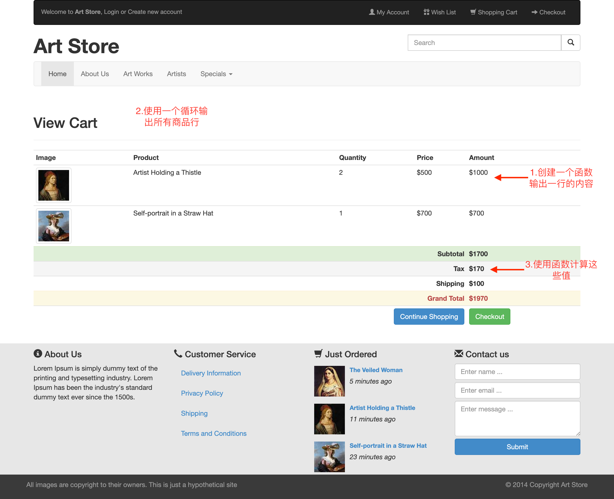

LAB 5作业要求
==========
本 LAB 只提供初始代码与完成效果图，需要通过修改初始代码使得最终网页展示效果与我们提供的效果图基本一致。

-------------------

## 作业提交 HOW TO SUBMIT
### 作业提交网址 ADDRESS
//github.com/(Your ID)/**fdu-18ss-web-lab**

e.g. //github.com/veronicadavichi/**fdu-18ss-web-lab**

即上传到你 lab5 的仓库中

-------------------

### 文件结构 FILE STRUCTURE
`root` 即直接打开仓库所见的层，或写作 `/lab5`。

```
/lab5
	/lab5.html
	/lab5.css
	/images
	/bootstrap3
	/lab5 作业要求.md
	/sample.png
```

`lab5.html` 是<u>**唯一**</u>需要修改的页面，主要是<u>**Javascript的基础使用**</u>。

本Lab涉及到了**JavaScript中的循环与函数**，参考教材《Fundamentals of Web Development, 2nd Edition》相关章节。

-------------------

## 作业效果图与要求

如下：



**注意：从本次作业开始必须使用git提交，否则不给分，请尚未学会如何使用git命令操作的同学认真阅读相关文档，有问题及时咨询助教。**

# DDL

截止时间为**2019年4月25日23:59:59**，也就是下周周四。
